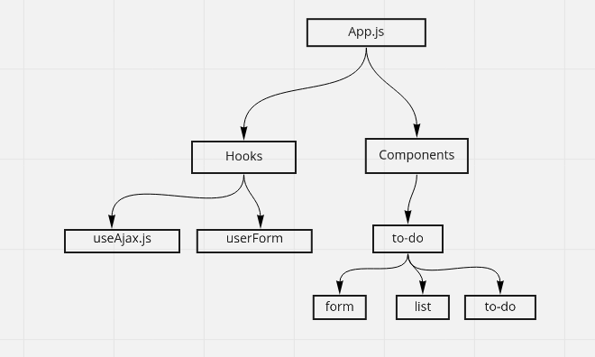

# React - Todo

### Available Scripts

In the project directory, you can run:

* `npm start`
* `npm test`
* `npm run build`
* `npm run lint`

### Schemas
* to-do Item

```javascript
const items = mongoose.Schema({
  text: { type: String, required: true },
  complete: { type: Boolean, required: true, default: false },
  difficulty: { type: String, required: true, default: 0 },
  assignee: { type: String, required: false },
});
```

### Project Phases

Phase 1: `to-do CRUD in memory`
Phase 2: `to-do CRUD using API`

# UML

